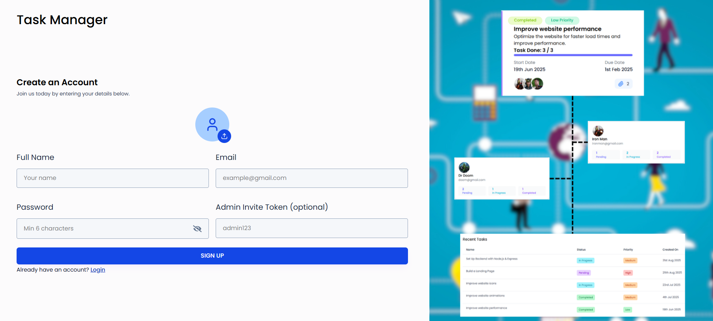
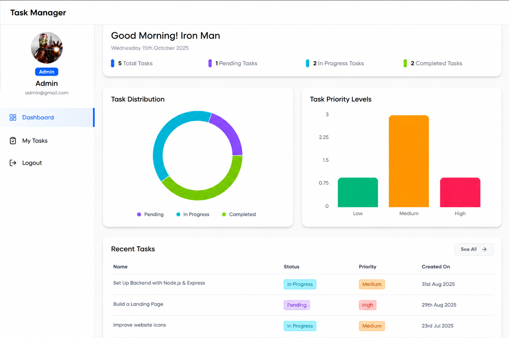
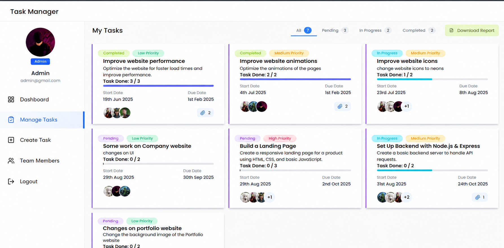

Task Manager (MERN Stack)

A modern full-stack Task Management Application built using the MERN stack, designed to help individuals and teams organize, track, and collaborate on tasks efficiently.

🌐 Live Demo
🔗 Frontend: https://your-frontend-url.vercel.app
🔗 Backend API: https://your-backend-url.onrender.com
✨ Key Features
🧑‍💻 Authentication & Security
Secure user authentication using JWT
Role-based access (Admin & User)
Protected routes with middleware
📊 Dashboard & Analytics
Dynamic dashboard with real-time statistics
Task distribution (Pie Chart)
Priority analysis (Bar Chart)
Auto greeting (Morning / Afternoon / Evening)
📋 Task Management
Create, update, delete tasks
Assign tasks to multiple users
Set priority (Low / Medium / High)
Add due dates and track deadlines
📈 Smart Tracking
Task progress calculation using checklist
Automatic status updates
Overdue task detection
👥 Team Collaboration
Assign tasks to team members
View user-specific tasks
Admin can manage all users
📎 Extra Features
File attachments support
Downloadable reports
Responsive UI (Mobile + Desktop)
🛠️ Tech Stack
Frontend
React.js
Tailwind CSS
Axios
Recharts (Charts)
Backend
Node.js
Express.js
MongoDB (Mongoose)
Authentication
JSON Web Token (JWT)
📁 Project Structure
root/
│
├── backend/              # Node.js + Express API
│   ├── controllers/
│   ├── routes/
│   ├── models/
│   ├── middlewares/
│   └── server.js
│
├── frontend/Task-Manager/   # React App
│   ├── src/
│   ├── components/
│   ├── pages/
│   └── utils/
│
└── README.md
⚙️ Environment Variables

Create a .env file in the backend folder:

PORT=5000
MONGO_URI=your_mongodb_atlas_url
JWT_SECRET=your_secret_key
CLIENT_URL=http://localhost:5173
🧪 Run Locally
1️⃣ Clone Repository
git clone https://github.com/your-username/task-manager.git
cd task-manager
2️⃣ Install Dependencies
Backend
cd backend
npm install
Frontend
cd ../frontend/Task-Manager
npm install
3️⃣ Start Application
Backend
npm run dev
Frontend
npm run dev

👉 Open: http://localhost:5173

📊 API Endpoints (Important)
Method	Endpoint	Description
POST	/api/auth/login	User login
GET	/api/tasks	Get all tasks
GET	/api/tasks/dashboard-data	Dashboard analytics
POST	/api/tasks	Create task
PUT	/api/tasks/	Update task
DELETE	/api/tasks/	Delete task
🚀 Deployment
Backend (Render)
Deploy Node.js server
Add environment variables
Connect MongoDB Atlas
Frontend (Vercel)
Deploy React app
Update API base URL
📸 Screenshots
🔐 Authentication

📊 Dashboard
Task Manager (MERN Stack)

A modern full-stack Task Management Application built using the MERN stack, designed to help individuals and teams organize, track, and collaborate on tasks efficiently.

🌐 Live Demo
🔗 Frontend: https://your-frontend-url.vercel.app
🔗 Backend API: https://your-backend-url.onrender.com
✨ Key Features
🧑‍💻 Authentication & Security
Secure user authentication using JWT
Role-based access (Admin & User)
Protected routes with middleware
📊 Dashboard & Analytics
Dynamic dashboard with real-time statistics
Task distribution (Pie Chart)
Priority analysis (Bar Chart)
Auto greeting (Morning / Afternoon / Evening)
📋 Task Management
Create, update, delete tasks
Assign tasks to multiple users
Set priority (Low / Medium / High)
Add due dates and track deadlines
📈 Smart Tracking
Task progress calculation using checklist
Automatic status updates
Overdue task detection
👥 Team Collaboration
Assign tasks to team members
View user-specific tasks
Admin can manage all users
📎 Extra Features
File attachments support
Downloadable reports
Responsive UI (Mobile + Desktop)
🛠️ Tech Stack
Frontend
React.js
Tailwind CSS
Axios
Recharts (Charts)
Backend
Node.js
Express.js
MongoDB (Mongoose)
Authentication
JSON Web Token (JWT)
📁 Project Structure
root/
│
├── backend/              # Node.js + Express API
│   ├── controllers/
│   ├── routes/
│   ├── models/
│   ├── middlewares/
│   └── server.js
│
├── frontend/Task-Manager/   # React App
│   ├── src/
│   ├── components/
│   ├── pages/
│   └── utils/
│
└── README.md
⚙️ Environment Variables

Create a .env file in the backend folder:

PORT=5000
MONGO_URI=your_mongodb_atlas_url
JWT_SECRET=your_secret_key
CLIENT_URL=http://localhost:5173
🧪 Run Locally
1️⃣ Clone Repository
git clone https://github.com/your-username/task-manager.git
cd task-manager
2️⃣ Install Dependencies
Backend
cd backend
npm install
Frontend
cd ../frontend/Task-Manager
npm install
3️⃣ Start Application
Backend
npm run dev
Frontend
npm run dev

👉 Open: http://localhost:5173

📊 API Endpoints (Important)
Method	Endpoint	Description
POST	/api/auth/login	User login
GET	/api/tasks	Get all tasks
GET	/api/tasks/dashboard-data	Dashboard analytics
POST	/api/tasks	Create task
PUT	/api/tasks/	Update task
DELETE	/api/tasks/	Delete task
🚀 Deployment
Backend (Render)
Deploy Node.js server
Add environment variables
Connect MongoDB Atlas
Frontend (Vercel)
Deploy React app
Update API base URL

📸 Screenshots---
🔐 Authentication

📊 Dashboard

📋 Tasks

